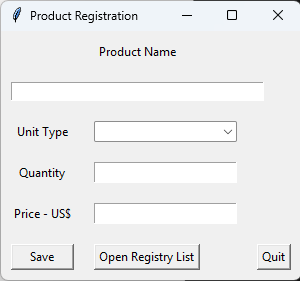

# Product Registry
#### Video Demo:  [Final Project](https://www.youtube.com/watch?v=heHv0pcXO4A)
#### Description:

The developed program aims to manage inventory by allowing for the registration of products, including the unit type (piece, package, box, or kilogram), quantity, and unit price.

After entering this information and clicking the `save` button, the data is saved to a `.txt` file (`products.txt`), where it remains available for review. The data entry window itself includes a button (`Open Registry List`) to open the product records directly in Notepad, as well as an exit button (`Quit`).

The `products.txt` file is included with the program and is responsible for storing all saved data: the registered product code, product name, unit type, quantity, and price per unit.

---
##### Architecture & Core Components

The `project.py` file contains all the program logic. The following libraries were used:
* **`tkinter`**: to create the window (GUI),
* **`os`**: for opening files and input/output operations,
* **`pathlib`**: to locate the `products.txt` file (since the path changes when running the program on a different computer), and
* **`subprocess`**: to launch an external program—specifically `notepad.exe`, which was chosen to open the `products.txt` file.

In the `project.py` file, we have:

* **Global Variable**
  * `save_list`: a list of tuples containing all products registered during the session. Tuples were chosen because the data stored within them cannot be modified. The purpose of this variable is to store the data to be written to `products.txt` and to serve as a reference for counting and generating product codes.

* **The `main` Function**
  * Contains the GUI logic used by the user, such as labels and input fields. It includes a list of unit types—`["pcs", "pack", "box", "kg"]`—and three additional functions: `save`, `write_in_txt`, and `open_registry`.

* **The `save` Function**
  * Takes the product name, unit type, quantity, and price as parameters. The inputs accept only `tk.Entry` objects—the format returned by the `tkinter` library. 
  * The function also utilizes a variable named `lines`, which represents the code number for each new line to be written in`products.txt`; it tracks the number of filled lines—that is, the number of products already registered—by summing the quantity of tuples stored in the `save_list`. 
  * Within the `save` function, the `os` library is used to open the file and count the existing lines, storing the result in the `lines` variable. Next, a `code` variable is created, formatted as a four-digit string based on the integer value in `lines`, while the variables `product`, `type_u`, `qtt`, and `price` are defined as strings derived from the function parameters and the `tkinter` `.get()` method. 
  * Finally, these variables are combined into a tuple, added to the list, and the `write_in_txt` function is called.

* **The `write_in_txt` Function**
  * Takes as a parameter a string representing the name of an existing file into which the contents of the global variable `save_list` will be written. 
  * The function begins by using the `os` library to open the specified file; it then uses a `for` loop to unpack the contents of each tuple stored in `save_list` and write them to that file. 
  * If the write operation completes without errors, the message `Save successfully` is returned; otherwise, it returns `File not found`.

* **The `open_registry` Function**
  * Is responsible for executing `notepad.exe` and opening the `products.txt` file within it. 
  * The function locates the root path using the `pathlib` library and saves it to the `root` variable. Next, the `file_path` variable is populated with the content of `root` followed by `/` and `products.txt` (`root/'products.txt'`) to represent the file path; finally, the `subprocess` library is used to open the file in Notepad.

---

##### Project Dependencies

The `requirements.txt` file contains the external Python libraries used for the project.

---

##### Testing Framework (`test_project.py`)

The `test_project.py` file contains tests for each function, utilizing the `pytest` library to execute the tests, `unittest.mock` to mock data (such as global variable lists, file paths, and the file to be opened), and `pathlib`, in addition to importing the functions to be tested from `project.py`.

* There is a test for the `save` function named `test_save`,
* Two tests for the `write_in_txt` function: one for the success case, named `test_write_in_txt`, and another for the error case, named `test_write_in_txt_error`, and
* A test function for `open_registry`, named `test_open_registry`.

---
## 📸 Screenshots / Demo
)]

---
## 🚀 How to Run the Project

1. **Clone the repository:**
   ```bash
   git clone [https://github.com/seu-usuario/seu-repositorio.git](https://github.com/seu-usuario/seu-repositorio.git)
   cd seu-repositorio

2. **Install the dependencies:**
   ```bash
   pip install -r requirements.txt

3. **Run the application:**
   ```bash
   python project.py